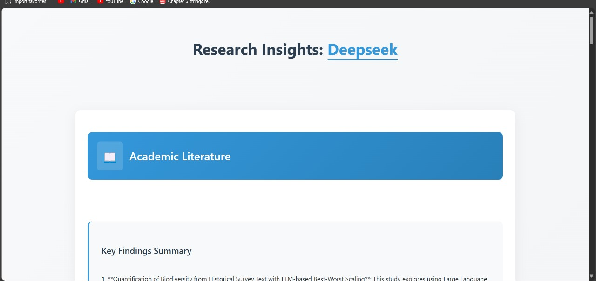
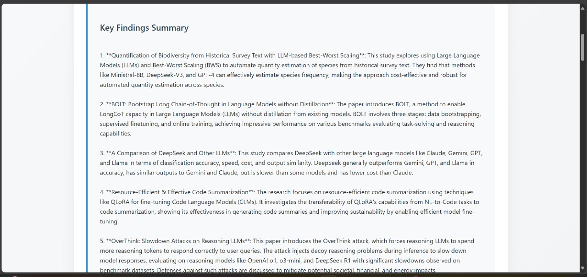

# Research AI

## Overview
Research AI is a Flask-based web application that helps users stay updated with the latest research papers and news articles on a given topic. The application integrates arXiv for research papers, Google News for recent developments, and OpenAI's API for summarization.

## Features
- **Fetch Latest Research Papers**: Retrieves the top 5 most recent research papers from arXiv.
- **Fetch Latest News Articles**: Gets the latest 5 news articles from Google News RSS feeds.
- **AI-Powered Summarization**: Uses OpenAI's API to generate concise summaries of research papers and news articles.
- **User-Friendly Web Interface**: Allows users to search for topics and view results in a structured format.

## Tech Stack
- **Backend**: Python, Flask
- **Frontend**: HTML, CSS
- **APIs Used**:
  - arXiv API for research papers
  - Google News RSS feed for news
  - OpenAI API for text summarization
- **Other Libraries**: feedparser, requests

## Installation
### Prerequisites
Ensure you have the following installed:
- Python 3.x
- pip (Python package manager)

### Steps
1. **Clone the repository**
   ```bash
   git clone https://github.com/1aryantyagi/RESEARCH_AI_BOT.git
   cd research-ai
   ```
2. **Install dependencies**
   ```bash
   pip install -r requirements.txt
   ```
3. **Run the application**
   ```bash
   python app.py
   ```
4. **Access the web interface**
   Open your browser and go to:
   ```
   http://127.0.0.1:5000/
   ```

## File Structure
```
RESEARCH_AI/
│── images/                # Stores images for documentation
│── static/                # CSS and JavaScript files
│── templates/             # HTML templates
│── app.py                 # Flask application entry point
│── main.py                # Core logic for fetching and summarizing data
│── requirements.txt        # List of dependencies
```

## Usage
1. Open the web application.
2. Enter a topic of interest in the search bar.
3. Click "Search" to fetch the latest research papers and news articles.
4. View the AI-generated summaries to quickly grasp the key insights.

## Example Output
- **User searches for 'Artificial Intelligence'**
- **Research Papers Section:**
  - "Title: Advances in AI"
  - "Summary: This paper discusses the latest advancements in deep learning..."
- **News Articles Section:**
  - "Headline: AI is Transforming Healthcare"
  - "Source: BBC News"

## Future Enhancements
- **Advanced Search Filters** (e.g., publication year, journal name)
- **Multi-language Support**
- **User Authentication for Personalized Recommendations**


## Sample project images





## Contributions
Feel free to contribute by submitting pull requests or raising issues.

## License
This project is licensed under the MIT License.

## Contact
For any queries, reach out to Aryan Tyagi at 1aryantyagi@gmail.com.

